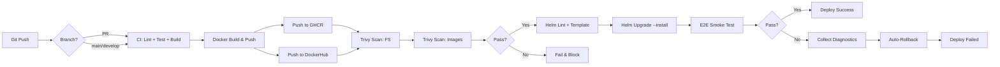

# Architecture Documentation

## Table of Contents
- [System Overview](#system-overview)
- [Component Architecture](#component-architecture)
- [Data Flow](#data-flow)
- [Infrastructure Architecture](#infrastructure-architecture)
- [CI/CD Architecture](#cicd-architecture)
- [Observability Architecture](#observability-architecture)

## System Overview

The K8s-Helm-CICD-Portfolio is a production-grade microservices demonstration platform showcasing modern DevOps practices. It implements a FastAPI web service with asynchronous task processing using Celery workers, all orchestrated on Kubernetes.

### Key Design Principles

1. **Cloud-Native**: Built for containerized environments with Kubernetes-first design
2. **GitOps**: Declarative infrastructure managed through Helm charts
3. **Observability**: Prometheus metrics, health checks, and structured logging
4. **Reliability**: High availability through HPA, health probes, and automated rollbacks
5. **Security**: Non-root containers, secret management, network policies

## Component Architecture

```
┌──────────────────────────────────────────────────────────────────────┐
│                         KUBERNETES CLUSTER                           │
│                                                                      │
│  ┌────────────────────────────────────────────────────────────────┐  │
│  │                    Ingress Controller (NGINX)                  │  │
│  │                  Host: api.<minikube-ip>.nip.io                │  │
│  └────────────────────────────┬───────────────────────────────────┘  │
│                               │                                      │
│  ┌────────────────────────────▼───────────────────────────────────┐  │
│  │                      Service: api (ClusterIP)                  │  │
│  │                         Port: 80 → 8000                        │  │
│  └────────────────────────────┬───────────────────────────────────┘  │
│                               │                                      │
│  ┌────────────────────────────▼───────────────────────────────────┐  │
│  │                   Deployment: api (FastAPI)                    │  │
│  │  ┌──────────────────────────────────────────────────────────┐  │  │
│  │  │ Pod: api-xxxxxxxxxx-xxxxx                                │  │  │
│  │  │                                                          │  │  │
│  │  │  Container: api                                          │  │  │
│  │  │  - Image: ghcr.io/user/october-api:dev                   │  │  │
│  │  │  - Port: 8000                                            │  │  │
│  │  │  - Endpoints:                                            │  │  │
│  │  │    • GET /healthz  (liveness)                            │  │  │
│  │  │    • GET /ready    (readiness)                           │  │  │
│  │  │    • GET /metrics  (Prometheus)                          │  │  │
│  │  │                                                          │  │  │
│  │  │  Probes:                                                 │  │  │
│  │  │  - Startup: /healthz (30x10s)                            │  │  │
│  │  │  - Liveness: /healthz (every 10s)                        │  │  │
│  │  │  - Readiness: /ready (every 10s)                         │  │  │
│  │  │                                                          │  │  │
│  │  │  Resources:                                              │  │  │
│  │  │  - Requests: 100m CPU, 128Mi RAM                         │  │  │
│  │  │  - Limits: 500m CPU, 512Mi RAM                           │  │  │
│  │  └──────────────────────────────────────────────────────────┘  │  │
│  │                                                                │  │
│  │  HPA: 1-5 replicas (target: 70% CPU)                           │  │
│  └────────────────────────────────────────────────────────────────┘  │
│                               │                                      │
│                               │ (Celery Broker/Backend)              │
│                               ▼                                      │
│  ┌────────────────────────────────────────────────────────────────┐  │
│  │                   Service: redis (ClusterIP)                   │  │
│  │                        Port: 6379 → 6379                       │  │
│  └────────────────────────────┬───────────────────────────────────┘  │
│                               │                                      │
│  ┌────────────────────────────▼───────────────────────────────────┐  │
│  │                   Deployment: redis                            │  │
│  │  ┌──────────────────────────────────────────────────────────┐  │  │
│  │  │ Pod: redis-xxxxxxxxxx-xxxxx                              │  │  │
│  │  │                                                          │  │  │
│  │  │  Container: redis                                        │  │  │
│  │  │  - Image: redis:7-alpine                                 │  │  │
│  │  │  - Port: 6379                                            │  │  │
│  │  │  - Volume: /data (PersistentVolumeClaim)                 │  │  │
│  │  │                                                          │  │  │
│  │  │  Resources:                                              │  │  │
│  │  │  - Requests: 100m CPU, 128Mi RAM                         │  │  │
│  │  │  - Limits: 200m CPU, 256Mi RAM                           │  │  │
│  │  └──────────────────────────────────────────────────────────┘  │  │
│  │                               │                                │  │
│  │                               ▼                                │  │
│  │                  PersistentVolumeClaim: redis-data             │  │
│  │                         Size: 1Gi                              │  │
│  └────────────────────────────────────────────────────────────────┘  │
│                               ▲                                      │
│                               │ (Consumes tasks)                     │
│  ┌────────────────────────────┴───────────────────────────────────┐  │
│  │                   Deployment: worker (Celery)                  │  │
│  │  ┌──────────────────────────────────────────────────────────┐  │  │
│  │  │ Pod: worker-xxxxxxxxxx-xxxxx                             │  │  │
│  │  │                                                          │  │  │
│  │  │  Container: worker                                       │  │  │
│  │  │  - Image: ghcr.io/user/october-worker:dev                │  │  │
│  │  │  - Command: celery worker                                │  │  │
│  │  │  - Broker: redis://redis:6379/0                          │  │  │
│  │  │                                                          │  │  │
│  │  │  Tasks:                                                  │  │  │
│  │  │  - add(x, y) → int                                       │  │  │
│  │  │  - ping() → "pong"                                       │  │  │
│  │  │                                                          │  │  │
│  │  │  Resources:                                              │  │  │
│  │  │  - Requests: 100m CPU, 128Mi RAM                         │  │  │
│  │  │  - Limits: 500m CPU, 512Mi RAM                           │  │  │
│  │  └──────────────────────────────────────────────────────────┘  │  │
│  └────────────────────────────────────────────────────────────────┘  │
│                                                                      │
└──────────────────────────────────────────────────────────────────────┘
```

## Data Flow

### Request Flow (HTTP)

```
1. External Client
   ↓ HTTP GET /healthz
2. Ingress Controller (NGINX)
   ↓ Route to api.<domain>
3. Service: api
   ↓ Load balance to Pod
4. Deployment: api (FastAPI)
   ↓ Process request
5. Response ← {"status": "ok"}
```

### Task Processing Flow (Async)

```
1. API receives task request
   ↓
2. Enqueue task to Redis (Celery broker)
   ↓ task_id, args, kwargs
3. Redis stores task in queue
   ↓
4. Worker polls Redis for tasks
   ↓ Dequeue task
5. Worker executes task function
   ↓ result
6. Worker stores result in Redis (backend)
   ↓
7. API can retrieve result by task_id
```

### Metrics Flow (Observability)

```
1. Application metrics generated
   ↓ (counter, gauge, histogram)
2. Prometheus client library
   ↓ Expose at /metrics
3. Prometheus server scrapes /metrics
   ↓ Every 15s (configurable)
4. Prometheus stores time-series data
   ↓
5. Grafana queries Prometheus
   ↓ PromQL
6. Dashboard visualizes metrics
```

## Infrastructure Architecture

### Namespace Isolation

```
Namespace: october
├── Deployments
│   ├── api (FastAPI application)
│   ├── redis (Message broker/cache)
│   └── worker (Celery task processor)
├── Services
│   ├── api (ClusterIP: 80 → 8000)
│   └── redis (ClusterIP: 6379)
├── Ingress
│   └── api-ingress (NGINX, host: api.<domain>)
├── ConfigMaps
│   └── app-config (environment variables)
├── Secrets
│   └── app-secrets (sensitive configuration)
├── PersistentVolumeClaims
│   └── redis-data (1Gi storage)
└── HorizontalPodAutoscaler
    └── api-hpa (1-5 replicas, target: 70% CPU)
```

### Network Policies (Planned M4)

```
┌──────────────────────────────────────────┐
│         Ingress Traffic Rules            │
│                                          │
│  Internet → Ingress Controller           │
│  Ingress → Service: api                  │
│  api → redis (6379/tcp)                  │
│  worker → redis (6379/tcp)               │
│                                          │
│  Deny:                                   │
│  - api ↛ worker (no direct comm)         │
│  - External → redis (no direct access)   │
└──────────────────────────────────────────┘
```

## CI/CD Architecture

### Pipeline Architecture



### CI Stage: Build & Test

**Workflow**: `.github/workflows/ci.yml`

**Triggers**:
- Pull requests (when code/config changes)
- Push to `main` or `develop`

**Jobs**:
1. **python-tests**
   - Lint with `ruff`
   - Format check with `black`
   - Unit tests with `pytest` + coverage

2. **docker-build-push** (matrix: api/worker × ghcr/dockerhub)
   - Build multi-platform images (amd64/arm64)
   - Tag strategy:
     - `:dev` (latest from main/develop)
     - `:sha-<7chars>` (immutable commit hash)
     - `:vX.Y.Z` (git tag releases)
   - Push to GHCR and DockerHub
   - Cache layers for faster rebuilds

### CD Stage: Deploy to Dev

**Workflow**: `.github/workflows/cd.yml`

**Triggers**:
- After successful CI workflow
- Manual dispatch

**Jobs**:
1. **trivy-fs**: Scan repository for vulnerabilities
2. **trivy-image**: Scan Docker images (fail on HIGH/CRITICAL)
3. **cd-dev**: Deploy to Kubernetes
   - Lint Helm chart
   - Template validation
   - Helm upgrade with `--atomic` flag
   - Retry logic (up to 3 attempts)
   - Post-deploy status check
   - E2E smoke test via Ingress
   - Fallback smoke via port-forward
   - Collect diagnostics on failure
   - **Auto-rollback to previous revision on failure**

### Deployment Strategy

**Rolling Update (Kubernetes Default)**:
```yaml
strategy:
  type: RollingUpdate
  rollingUpdate:
    maxSurge: 1        # Create 1 extra pod during update
    maxUnavailable: 0  # Keep all pods running
```

**Helm Atomic Deployments**:
- `--atomic`: Rollback automatically if deployment fails
- `--timeout 5m`: Maximum time for deployment
- `--history-max 10`: Keep last 10 revisions

### Image Registry Strategy

**Primary Registry**: GHCR (GitHub Container Registry)
- `ghcr.io/<user>/october-api`
- `ghcr.io/<user>/october-worker`

**Secondary Registry**: DockerHub
- `docker.io/<user>/october-api`
- `docker.io/<user>/october-worker`

**Tagging Convention**:
- Development: `:dev` (mutable, latest from develop)
- Commit-based: `:sha-a1b2c3d` (immutable)
- Release: `:v0.1.0` (semantic versioning)

## Observability Architecture

### Health Check Endpoints

| Endpoint | Purpose | Kubernetes Probe | Response |
|----------|---------|------------------|----------|
| `/healthz` | Liveness check | startupProbe, livenessProbe | `{"status": "ok"}` |
| `/ready` | Readiness check | readinessProbe | `{"ready": true}` |
| `/metrics` | Prometheus metrics | N/A (scraped) | Text/Prometheus format |

### Probe Configuration

**Startup Probe** (gives app time to start):
```yaml
startupProbe:
  httpGet:
    path: /healthz
    port: 8000
  initialDelaySeconds: 0
  periodSeconds: 10
  failureThreshold: 30  # 300s max startup time
```

**Liveness Probe** (restart if unhealthy):
```yaml
livenessProbe:
  httpGet:
    path: /healthz
    port: 8000
  periodSeconds: 10
  timeoutSeconds: 5
  failureThreshold: 3
```

**Readiness Probe** (remove from service if not ready):
```yaml
readinessProbe:
  httpGet:
    path: /ready
    port: 8000
  periodSeconds: 10
  timeoutSeconds: 5
  failureThreshold: 3
```

### Metrics & Monitoring

**Application Metrics** (exported at `/metrics`):
- `http_requests_total` (counter): Total HTTP requests by method/path/status
- `http_request_duration_seconds` (histogram): Request latency distribution with buckets
- `celery_tasks_total` (counter): Tasks processed by status (planned)
- `celery_task_duration_seconds` (histogram): Task execution time (planned)

**Prometheus Stack** (kube-prometheus-stack):
- **Prometheus**: Time-series database for metrics storage and querying
- **Grafana**: Visualization dashboards (RPS, latency p95, 5xx rate)
- **ServiceMonitor**: CRD for automatic metrics scraping configuration (requires `release: mon` label)
- **PrometheusRule**: CRD for alert definitions (CrashLoopBackOff, High CPU)
- **Alertmanager**: Alert routing and notification (included, advanced config pending)

**Infrastructure Metrics**:
- CPU usage per pod
- Memory usage per pod
- Network I/O
- Disk I/O (Redis PVC)

**Alerts** (Planned):
- CrashLoopBackOff > 5 minutes
- CPU usage > 80% for 5 minutes
- Error rate > 5% of requests

## Security Architecture

### Container Security

**Current Implementation**:
- Multi-stage Docker builds (smaller attack surface)
- Health checks in containers
- Resource limits (prevent resource exhaustion)

**Planned (M4)**:
- Non-root user (UID 1000)
- Read-only root filesystem
- Drop all capabilities, add only required
- Minimal base images (alpine/distroless)

### Secret Management

**Kubernetes Secrets**:
```yaml
apiVersion: v1
kind: Secret
metadata:
  name: app-secrets
type: Opaque
data:
  REDIS_PASSWORD: <base64-encoded>
  API_KEY: <base64-encoded>
```

**Best Practices**:
- Never commit secrets to git
- Use `secret.example.yaml` templates
- Rotate secrets regularly
- Use external secret managers (future: Vault, Sealed Secrets)

### Network Security (Planned M4)

**NetworkPolicy Example**:
```yaml
# Allow API to communicate with Redis only
apiVersion: networking.k8s.io/v1
kind: NetworkPolicy
metadata:
  name: api-to-redis
spec:
  podSelector:
    matchLabels:
      app: api
  policyTypes:
  - Egress
  egress:
  - to:
    - podSelector:
        matchLabels:
          app: redis
    ports:
    - protocol: TCP
      port: 6379
```

## Scalability Architecture

### Horizontal Pod Autoscaler (HPA)

**Configuration**:
```yaml
apiVersion: autoscaling/v2
kind: HorizontalPodAutoscaler
metadata:
  name: api-hpa
spec:
  scaleTargetRef:
    apiVersion: apps/v1
    kind: Deployment
    name: api
  minReplicas: 1
  maxReplicas: 5
  metrics:
  - type: Resource
    resource:
      name: cpu
      target:
        type: Utilization
        averageUtilization: 70
```

**Scaling Behavior**:
- Scale up: When avg CPU > 70% across all pods
- Scale down: When avg CPU < 70% for cooldown period
- Min replicas: 1 (dev), 2 (prod)
- Max replicas: 5 (dev), 10 (prod)

### Load Testing

**Tool**: `scripts/load_tester.py`

**Example**:
```bash
make load-test URL=http://api.192.168.49.2.nip.io/healthz CONC=200 DUR=120
```

**Observing Scale-Up**:
```bash
kubectl -n october get hpa api -w
kubectl -n october top pods
```

## Disaster Recovery

### Backup Strategy (Planned M5)

**Redis Data Backup**:
- RDB snapshots to PersistentVolume
- Export script: `scripts/redis-backup.sh`
- Schedule: Daily backups
- Retention: 7 days

**Restore Process**:
1. Stop worker deployment
2. Restore RDB to Redis pod
3. Restart Redis
4. Restart worker deployment

### Rollback Strategy

**Helm Rollback**:
```bash
# View history
helm history app -n october

# Rollback to specific revision
helm rollback app <revision> -n october

# Rollback to previous
make helm-rollback-last
```

**Automatic Rollback** (CI/CD):
- Triggered on smoke test failure
- Rolls back to previous Helm revision
- Diagnostics uploaded as artifacts

## Technology Stack

| Layer | Technology | Version | Purpose |
|-------|-----------|---------|---------|
| **Application** |
| Web Framework | FastAPI | Latest | REST API endpoints |
| Task Queue | Celery | Latest | Async task processing |
| Broker/Cache | Redis | 7-alpine | Message queue & cache |
| Metrics | Prometheus Client | Latest | Metrics exposition |
| **Infrastructure** |
| Container Runtime | Docker | 24+ | Containerization |
| Orchestration | Kubernetes | 1.28+ | Container orchestration |
| Package Manager | Helm | 3.14+ | K8s deployment management |
| Ingress | NGINX | Latest | HTTP routing |
| **CI/CD** |
| CI Platform | GitHub Actions | N/A | Build & test automation |
| Registry | GHCR, DockerHub | N/A | Container image storage |
| Security Scanner | Trivy | 0.24+ | Vulnerability scanning |
| **Observability** (Planned) |
| Metrics | Prometheus | Latest | Metrics collection |
| Visualization | Grafana | Latest | Dashboards |
| Alerting | Alertmanager | Latest | Alert management |

## Performance Characteristics

### Resource Requirements

**Development Environment** (Minikube):
- CPU: 4 cores recommended
- RAM: 8GB recommended
- Disk: 20GB

**Per Pod Resource Allocation**:
- API: 100m-500m CPU, 128Mi-512Mi RAM
- Worker: 100m-500m CPU, 128Mi-512Mi RAM
- Redis: 100m-200m CPU, 128Mi-256Mi RAM

### Latency Targets

- `/healthz`: < 50ms (p99)
- `/ready`: < 100ms (p99)
- Celery task (add): < 1s
- Celery task (ping): < 500ms

### Throughput

- API: ~1000 RPS per pod (estimated)
- Celery: ~100 tasks/sec per worker (estimated)

---

**Document Version**: 1.1
**Last Updated**: 2025-10-27
**Milestone**: Milestones Complete
